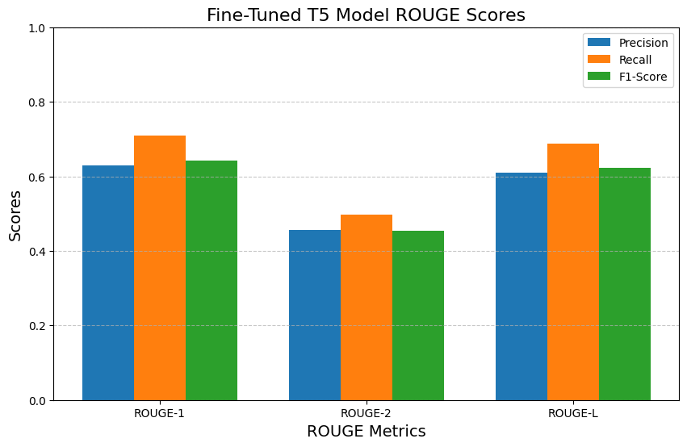

# Fine-Tuned T5 Model for LeetCode-Style Question Title Generation

Welcome to the **`t5-leetcode-title-gen`** repository! Based on the **google/flan-t5-large** model, this **T5-LeetCode-Title-Generator** has been  fine-tuned on over **2,600 LeetCode questions** specifically adapted to **generate LeetCode-style question titles for coding problems**.

## Model Purpose
This model is designed to:

- **Generate concise, professional, and LeetCode-style titles** for coding problems.
- **Standardize and enhance question organization** for **University-level Computer Science Entrance Exams**—critical assessments required for students entering the **Computer Science major** and taking **upper-level courses**.

By **automating and improving** the titling process, this model ensures:

- **More effective topic-based studying** by categorizing problems precisely.
- **A polished and consistent experience** for students and educators alike.


## Training Data

The model was fine-tuned on **2,612 LeetCode problems** using the [greengerong/leetcode dataset](https://huggingface.co/datasets/greengerong/leetcode) from Hugging Face.

### **Dataset Details**:
- **Problem Descriptions**: Clear explanations of coding challenges.
- **Associated Question Titles**: Well-structured and concise titles.
- **Code Solutions**: Implementations in multiple languages:
  - Java
  - C++
  - Python
  - JavaScript

The fine-tuning process ensured the model learned the LeetCode-style titling patterns, making it highly effective for generating professional-grade titles for new problems.<br>


## Model Description

 As input, the T5-LeetCode-Title-Generator **accepts detailed problem descriptions** and **outputs concise, meaningful titles**. This task is particularly useful for platforms that host programming challenges and educational content or for University Computer Science Entrance Exams.<br>


## How It Works

This fine-tuned **T5 model** leverages its **sequence-to-sequence** capabilities to:

1. Take a **coding problem description** as input  
   **Example**: `"Write a function to find the longest common prefix in an array of strings."`
2. Generate a **clear, professional title**  
   **Output**: `"Longest Common Prefix"`

### Quickstart Code:
```python
from transformers import AutoModelForSeq2SeqLM, AutoTokenizer

# Load the fine-tuned model and tokenizer
model = AutoModelForSeq2SeqLM.from_pretrained("your-username/fine-tuned-t5-model")
tokenizer = AutoTokenizer.from_pretrained("your-username/fine-tuned-t5-model")

# Input a coding problem description
description = "Write a function to check if a string is a valid palindrome."

# Tokenize and generate the title
inputs = tokenizer(f"Generate a LeetCode-style question title: {description}", return_tensors="pt")
outputs = model.generate(**inputs, max_length=15, num_beams=4, early_stopping=True)

# Decode the generated title
generated_title = tokenizer.decode(outputs[0], skip_special_tokens=True)
print("Generated Title:", generated_title)
```


## Evaluation & Performance Gains

### ROUGE Score Improvements

The **fine-tuned model** significantly outperforms the **non-fine-tuned google/flan-t5-large model** across **all key metrics**:

- **ROUGE-1 Improvements**:
  - **Precision**: **+107.6%** increase (0.3028  →  0.6285)
  - **Recall**: **+83.14%** increase (0.3874 → 0.7095)
  - **F1-Score**: **+105.8%** increase (0.3118 → 0.6416)

- **ROUGE-2 Improvements**:
  - **Precision**: **+216.1%** increase (0.1441 → 0.4554)
  - **Recall**: **+169.5%** increase (0.1843 → 0.4966)
  - **F1-Score**: **+209.6%** increase (0.1466 → 0.4539)

- **ROUGE-L Improvements**:
  - **Precision**: **+113.5%** increase (0.2860 → 0.6107)
  - **Recall**: **+87.59%** increase (0.3667 → 0.6879)
  - **F1-Score**: **+111.3%** increase (0.2951 → 0.6234)<br><br>


### **Visual ROUGE Score Comparisons**: <br>
---


<br>**Non-Fine-Tuned T5 Model ROUGE Scores:**<br>  


---

<br>**Fine-Tuned T5 Model ROUGE Scores:**<br>  


---

## Fine-Tuning Methodology

The **fine-tuned model** used **Hugging Face’s Trainer API** with the following hyperparameters:

- **Learning Rate**: `2e-5`
- **Weight Decay**: `0.01`
- **Epochs**: `3`
- **Batch Size**: `2` (due to GPU limitations)
- **Gradient Accumulation Steps**: `2`
- **Gradient Checkpointing**: `True`

During training:
- **Training loss decreased significantly**, indicating **effective learning**.
- **Validation loss decreased steadily**, ensuring **robust generalization**.

---

## Future Improvements

1. **Reduce `max_length`**  
   - Currently **256** tokens → Lowering to **100-125** to align with **exam question length**.

2. **Disable `gradient_checkpointing`**  
   - Since the **fine-tuning used a CPU**, disabling this will optimize performance.

3. **Optimize Learning Rate**  
   - Adjusting **learning rate decay** to further refine **title accuracy**.

---

## Conclusion

With **dramatically improved performance** in **ROUGE-1, ROUGE-2, and ROUGE-L**, this fine-tuned **T5 model** is an ideal solution for **LeetCode-style title generation**. It offers **concise, high-quality titles**, making **University Computer Science Entrance Exams** more structured and effective.

🔗 **Try it now on Hugging Face**: [e4s70f3d3n/fine-tuned-t5-model](https://huggingface.co/your-username/fine-tuned-t5-model)


## Key Features:
- **Developed by:** Annalisa Vitulli
- **Languages:** English (`en`)
- **Model Type:** Text-to-text Transfer Transformer (T5)
- **License:** Custom (see LICENSE.txt for details)
- **Parent Model:** [google/flan-t5-large](https://huggingface.co/google/t5-large)
- **Dataset Used:** [greengerong/leetcode](https://huggingface.co/datasets/greengerong/leetcode)
